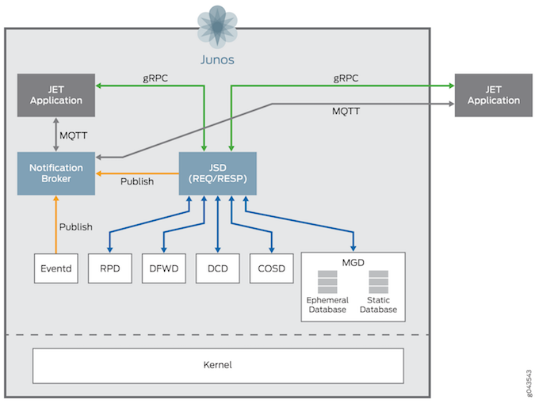

## PyEZ - JET



This set of demos covers Juniper's JET.

Juniper Extension Toolkit (JET) is the evolutionary step onwards from Juniper's SDK (software development kit).

This JET offering allows network operators to design and run network applications that are closely coupled to Junos. These applications could be closed-loop or open.

JET has direct support for `on-box` C, C++ and Python applications. The underlying libraries that these programming languages use have been modified for Junos. Python code uses the libraries directly and C and C++ code is compiled within a sandbox environment. The code is copied to Junos and some minimal configuration is applied that enables this code to be ran. 

C and C++ applications require the installation package to be signed. This requires [emailing Juniper's certificate team](mailto: jet-cert@juniper.net).

JET offers both library and gRPC paths for programmability. These APIs are supported as of version 17.4 through the associated IDL (GPB) files.

*BGP Service API*
*Class of Service (CoS) API*
*Firewall Service API*
*Interfaces Service API*
*Management Service API*
*MPLS Service API*
*Programmable Routing Process Common (PRPD Common) API*
*Programmable Routing Process Service (PRPD) API*
*Registration Service API*

## Demo One

Let's run a simple on-box Python application. The source code of which is located [here](https://github.com/Juniper/jet-app-store/tree/master/JET-Tutorial-Apps).

```python
#!/usr/bin/env python
#
# Import Python GRPC module
import grpc

import socket

# Import python modules generated from proto files
import management_service_pb2
import authentication_service_pb2

# IMPORTANT: Following are the dummy parameters that will be used for testing
# Please change these parameters for proper testing

# Device details and login credentials
JSD_IP = '10.42.0.130'   # Update with your device name/IP
JSD_PORT = 50051
USERNAME = 'jet'       # Update with your device login details
PASSWORD = 'Passw0rd'       # Update with your device login details
CLIENT_ID = socket.gethostname()
_TIMEOUT_SECONDS = 20


def EstablishChannel(address, port, client_id, user, password):
    # Open a grpc channel to the device
    # creds = implementations.ssl_channel_credentials(open('/tmp/host.pem').read(), None, None)
    # channel = implementations.secure_channel(address, port, creds)

    try:
        channel = grpc.insecure_channel('%s:%d' % (address, port))

        auth_stub = authentication_service_pb2.LoginStub(channel)

        login_response = auth_stub.LoginCheck(
            authentication_service_pb2.LoginRequest(
                user_name=user,
                password=password,
                client_id=client_id), _TIMEOUT_SECONDS)

        if login_response.result == 1:
            print("Login successful")
            return channel
        else:
            print("Login failed")
            sys.exit(1)

    except Exception as tx:
        print(tx)

def ManagementTests(channel):

    # Create a stub for Management RPC
    stub = management_service_pb2.ManagementRpcApiStub(channel)

    # Execute ExecuteOpCommand RPC
    executeOpCommandrequest = management_service_pb2.ExecuteOpCommandRequest(cli_command="show system uptime",
                                                                             out_format=management_service_pb2.OPERATION_FORMAT_CLI,
                                                                             request_id=1000)

    for response in stub.ExecuteOpCommand(executeOpCommandrequest, _TIMEOUT_SECONDS):
        print response

def Main():

    #Establish a connection and authenticate the channel
    channel = EstablishChannel(JSD_IP, JSD_PORT, CLIENT_ID, USERNAME, PASSWORD)

    # Call sample operational command
    ManagementTests(channel)

if __name__ == '__main__':
    Main()
```

Note that two Python `pb` modules are required. To get these modules we have to obtain the IDL (`.proto`) Juniper modules first and compile them into Python. We obtain these `.proto` modules by downloading them [from the Juniper website.](https://www.juniper.net/support/downloads/?p=jet). Next we use the `protoc` protobuf compiler to generate the Python modules from the protocol buffer files.

In order to get `protoc`, download it from [GitHub](https://github.com/google/protobuf.git). It's also possible to download pre-built binaries for your chosen operating system.

For this demo, I'm using a container that also acts as a build environment for the `.proto` files. Instructions to run this container live [here](https://github.com/mwiget/jet-bgp-static-routes).

This demo also requires the following configuration on the vMX:

```bash
set system services extension-service request-response grpc clear-text port 50051
set routing-options programmable-rpd purge-timeout 120
set routing-options autonomous-system 64512
set protocols bgp group internal type internal
set protocols bgp group internal family inet unicast add-path send path-count 6
set protocols bgp group internal allow 0.0.0.0/0
```

To run this demo, cd to the jetcontainer directory, in my case: `/Users/dgee/Documents/JET/jetcontainer`.

```bash
cd /Users/dgee/Documents/JET/jetcontainer/jet-bgp-static-routes
make shell
./offboxdemoapp.py
```


## Demo 2

This next demo places BGP routes with multiple-next hops in to Junos through the JET API! Pretty cool.

For this demo to work, we also need this configuration in place:

```bash
set system services extension-service request-response grpc clear-text port 50051
set routing-options programmable-rpd purge-timeout 120
set routing-options autonomous-system 64512
set protocols bgp group internal type internal
set protocols bgp group internal family inet unicast add-path send path-count 6
set protocols bgp group internal allow 0.0.0.0/0
```

```bash
./jroutes_bgp.py --t 10.42.0.130 --port 50051 --user netconf --pass Passw0rd
```

What about notifications? Assuming the configuration is in place:

Assuming the configuration is in place:

```bash
python /home/davidgee/demos/jet/jet-app-store/JET-Tutorial-Apps/sampleNotifierApp.py
```

It connects up for a number of seconds and then it will disconnect.
The code for this simple demo application lives [here](https://github.com/Juniper/jet-app-store/blob/master/JET-Tutorial-Apps/sampleNotifierApp.py).

## Golang

For those who know me, I am a huge lover of Google's Go language. I took Marcel Wiget's original demo code and re-created it in Go! The binary is in this directory and the source code is located [here](https://github.com/DavidJohnGee/go-jet-demo-app).

```bash
./bgpStaticRoutes
```

Ensure you change the contents of the `config.toml` file to reflect the settings of your environment and change the routes being injected.

## Demo Close

JET provides useful APIs and a notification API. When a standard approach fails, JET might be the answer!

[jet-developer-guide](https://www.juniper.net/documentation/en_US/jet17.4/information-products/pathway-pages/jet-developer-guide.html)
