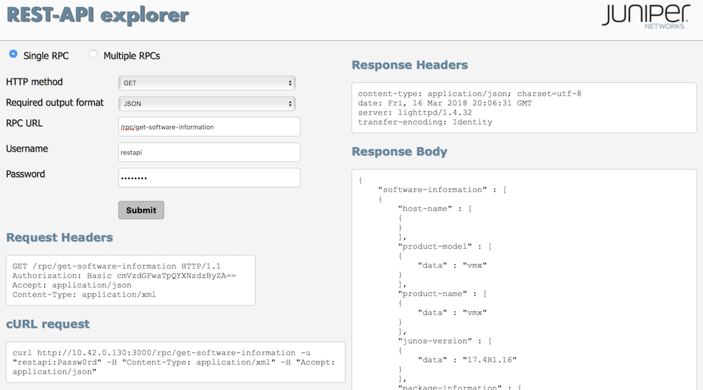

## README for REST Demo

This demonstrates how to use REST on a Junos.

__Basic REST__

REST is based on HTTP using verbs GET and POST. 

You can execute a single RPC command via GET or POST, or multiple RPC commands via a single POST.

Let's enable REST and something called the 'rest explorer'. 

```bash
set system services rest http
set system services rest enable-explorer
set system login user restapi class super-user
set system login user restapi authentication encrypted-password "$6$Z34lIl2Z$Egx3UHZSKK0.0iZ.oFEOMwzv4mTPGx57d9XB78mSE7PKxcLAZKPRQuIwHodGEPOwOPFB/BcRDprdrjBXulkjs."
```

Once committed, the API is available [here](http://10.42.0.130:3000)

First, let's use CURL a basic HTTP tool to execise the API.

```bash
curl http://10.42.0.130:3000/rpc/get-software-information -u "restapi:Passw0rd" -H "Content-Type: application/xml" -H "Accept: application/json"
```

REST Explorer is a web UI tool that allows us to explore the REST API.

Go to the REST Explorer [here](http://10.42.0.130:3000)

## REST Explorer

If you're familiar with Postman, it's similar!


